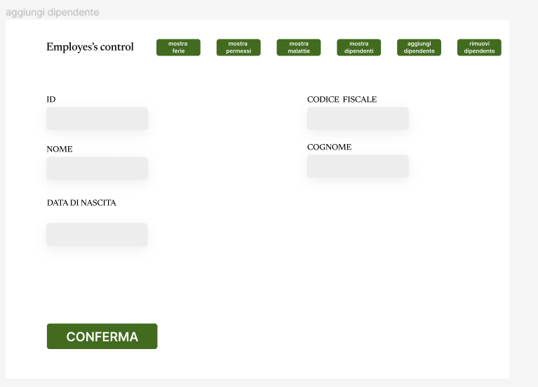

# Employees Control
###### Web App per la gestione dei dipendenti di un'azienda

Questa Web App prevede le seguenti funzionalità:

	- da la possibilità di inserire e rimuovere i propri dipendenti
 	- da la possibilità di inserire i gestori dei dipendenti, che possono inserire nuovi dipendenti, inserire le ferie, le 		 
	  malattie e i permessi dei vari dipendenti.
	- garantisce la possibilià di inserire le malattie di un dipendente e di visualizzare le malattie dei dipendenti in una tabella
 	- garantisce la possibilità di inserire le ferie dei dipendenti e di visualizzarle in una tabella
	- garantisce la possibilità di inserie i permessi dei dipendenti e di visualizzarli in una tabella

di seguito è elencato il mockup

#### login pagine

#### home page

#### tabella ferie

#### tabella malattie
!

#### tabella dipendenti

#### tabella permessi

#### aggiungi dipendente

#### rimuovi dipendente

#### inserisci malattia

#### inserisci ferie

#### inserisci permesso

###### E/R

###### schema relazionale

DIPENDENTE(_ID_, CF, NOME, COGNOME, DATADINASCITA, RETRIBUZIONEORARIA, OREDIPERMESSO, GIORNIDIMALATTIA, GIORNIDIFERIE)

FERIE(_ID_, DATAINIZIO, DATAFINE,NOME, COGNOME ,GIORNI, DIPENDENTE_ID)

PERMESSI(_ID_, NOME, COGNOME, ORAINIZIO, ORAFINE, GIORNO, DIPENDENTE_ID)

MALATTIA(_ID_, NOME, COGNOME, NUMEROMALATTIA, DATAINIZIO, DATAFINE,NUMEROGIORNI, DIPENDENTE_ID)

GESTORE(_ID_, NOME, COGNOME, EMAIL, PASSWORD)

CONTROLLA(DIPENDENTE_ID, GESTORE_ID)

###### istruzioni per l'uso

per utilizzare questa Web app si può ricorrere all'uso di XAMPP online.
nel codespace già creato il docker è già stato creato e configurato, qualora non fosse disponibile il codespace, se ne può creare un'altro e creare un nuovo XAMPP online attraverso la riga di comando qua sotto scritta:

docker run --name myXampp -p 41061:22 -p 41062:80 -d -v /workspaces/ProgettoQuinta:/www tomsik68/xampp:8

si consiglia l'utilizzo dell'estensione docker, quella ufficiale microsoft per facilitare lo start e lo stop di XAMPP.
nel file query.sql sono presenti tutte le query per la creazione delle varie tabelle, il database andrà necessariamente chiamamto progetto_quinta.
nella pagina di login non vi è la possibilità di registrarsi in quanto non necessario essendo un gestinale per le azione e non ad uso del pubblico, per registrare nuovi utenti bisogna necessariamente effettuare il login.

credenziali per il login:
- email: admin.progettoquinta@progettoquinta.com
- password: admin

se si dovesse creare un nuovo codespace, di conseguenza si dovranno ricreare tutte le tabelle nel nuovo databese, quando si aprirà per la prima volta la pagina login.php creerà in automatico le credenziali dell'utente sopra indicato.